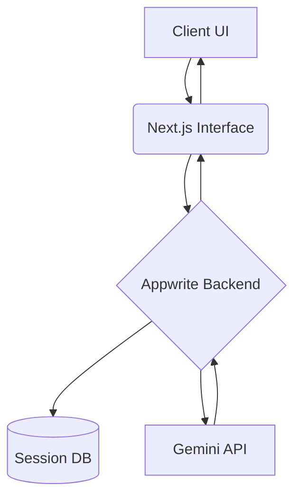

# Vision-to-Code: Core Parsing Engine (MVP)

> **Deployment Notice:** To ensure the security of the proprietary parsing logic and source code, the primary development environment is maintained in a private repository. This public repository serves as the official distribution hub for installation assets, technical documentation, and deployment releases.

---

## The Rationale

A significant bottleneck in modern frontend development is the "AI-refinement loop." Developers frequently spend excessive billable hours manually correcting or "arguing" with LLMs to fix minor UI alignment issues, margin inconsistencies, or component structures generated from text prompts.

Vision-to-Code eliminates this friction. By bypassing text-based layout descriptions and moving directly from a visual whiteboard sketch to deterministic code, the system ensures that the spatial intent of the developer is preserved, drastically reducing the time spent on iterative UI debugging.

---

## Architectural Overview

Vision-to-Code is a specialized SaaS infrastructure designed to translate raw, unstructured visual data into functional, component-based frontend code. The system utilises a decoupled architecture to handle heavy image-processing tasks without compromising client-side performance.

---

## Source Code & IP Notice

The core engine—specifically the custom prompt-chaining algorithms and multimodal parsing logic—is strictly closed-source. This repository acts as the public interface for issue tracking and future binary distribution. No proprietary backend functionality is exposed within this documentation.

---

## Live MVP Demonstration

The following demonstration highlights the core ingestion loop, where a hand-drawn architectural sketch is processed and rendered into a live Next.js preview in real-time.

https://github.com/user-attachments/assets/fcea542c-9f44-409e-9ff7-6e34a458f2b2

---

## System Architecture & Tech Stack

The infrastructure is built for high availability and low-latency inference:

| Layer | Technology |
| --- | --- |
| **Frontend Framework** | Next.js with Tailwind CSS for utility-first, deterministic styling |
| **Backend Infrastructure** | Appwrite for secure session management and document persistence |
| **Cognitive Layer** | Gemini API for multimodal vision parsing and spatial layout analysis |

---

## System Data Flow

---

## Installation & Deployment

> **Note:** Deployment assets, including executable binaries and installation scripts for Windows and Linux environments, will be provided in the **Releases** tab upon the completion and QA testing of the current staging cycle.

---

## Development & Scaling Roadmap

### Phase 1: Core System Polish *(Current)*

- **Pipeline Stabilization:** Refinement of the vision-to-HTML/CSS translation logic.
- **Heuristic Improvements:** Enhancing the engine's ability to interpret low-contrast or unstructured visual inputs.
- **Component Expansion:** Implementation of modular React/Next.js output targets.

### Phase 2: Identity & Access Management (IAM)

- **Secure Authentication:** Deployment of OAuth-based user sessions via Appwrite.
- **Traffic Control:** Implementation of strict API rate-limiting to manage token consumption.
- **User Persistence:** Creation of isolated workspaces and generation history logs.

### Phase 3: Monetization & Cloud Infrastructure

- **Subscription Management:** Integration of payment gateways (e.g., Stripe) for tiered access.
- **Global Scaling:** Migration to advanced cloud infrastructure with edge-network load balancing.
- **CI/CD Integration:** Automated deployment pipelines for seamless software updates.
